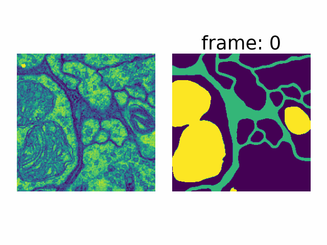

</img>

# 基于参考帧的图像分割

使用参考帧来提升分割的精度, 参考帧的思想来自于这篇论文[[paper](https://openaccess.thecvf.com/content_cvpr_2018/html/Oh_Fast_Video_Object_CVPR_2018_paper.html)],


数据集使用的是Drosophila cell image dataset，需要分割出membrane、mitochondria、synapses和cytoplasm四类

可以在这里下载[[Dataset](https://github.com/unidesigner/groundtruth-drosophila-vnc)]


## 安装

主要模块版本

```
torch 1.8.1
scikit-image 0.17.2
```

源码下载

```shell
git clone https://github.com/Prevalenter/reference_segmentation.git
```

## 快速开始

```
cd experiment
python exp.py
```

其中训练的结果保存在result文件夹下，使用了k-flod交叉验证精度

## 结果

消融实验分割结果：


部分效果图：


## 声明

代码整理于2021年春华东理工大学高级数字图像的课程论文